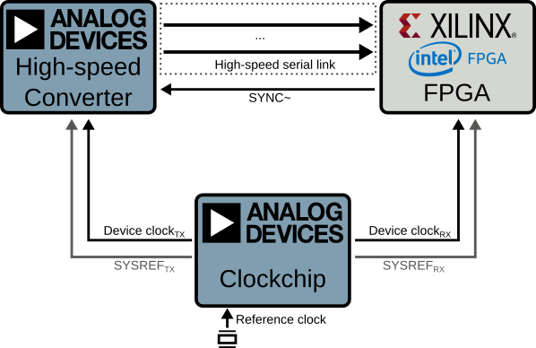

# pyadi-jif: Python interface for ADI JESD Interface Framework

This projects tries to simplify JESD configuration exploration and validation for ADI JESD based converters and clock chips with differnet FPGA vendors.

## Commands

* `mkdocs new [dir-name]` - Create a new project.
* `mkdocs serve` - Start the live-reloading docs server.
* `mkdocs build` - Build the documentation site.
* `mkdocs -h` - Print help message and exit.

## Project layout

    mkdocs.yml    # The configuration file.
    docs/
        index.md  # The documentation homepage.
        ...       # Other markdown pages, images and other files.
